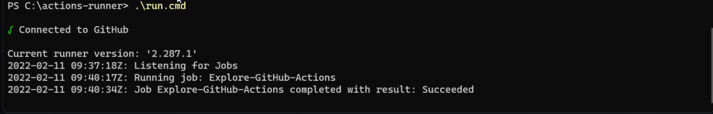

## Creating self hosted runner

I attempted to add self hosted runner which is a windows 11 virtual machine (my windows development machine). Here's the steps I took

1. Navigate to settings/actions/runners
2. Click "New self hosted runner"
3. Selected "Windows"
4. Followed instructions given on target machine
5. With the default labels also added a new one "tomkarho"
6. Changed workflow to run on self hosted by changing runs-on from `ubuntu-latest` to `[self-hosted, tomkarho]`

### Results

Powershell showed the following

